# PromQL (Prometheus Query Language)

## Data model

- stores data as time series
- every time series is identified by metric name and label
- labels are key and value pair
- labels are options

    <metric name> {key=value, key=value, ...}

    auth_api_hit {count=1, time_taken=800}

## Data types

### scalar
        float (1, 1.5)
        string  (any string in single or double quotes)

        example:
        
        store:
            http_request{code="200",job="prometheus"}
        
            note: "200" is a string here.

        query:
            http_request{code=~"2.*",job="prometheus"}

            note: ~"2.*" gets all code bewteen 200 to 299

            http_request{code=200,job="prometheus"}

            this will not return any data becuse query have float 200

### instant vectors
        - single sample value for each given timestamp
        - only metric name is specified
        - results can be filtered by labels

        example: 
            auth_api_hit 5

        query:
            auth_api_hit{count=1, time_taken=800}   # => 1

### range vectors
        - similar to instant vectors except they select a range of sample

        lable_name[time_spec]

        auth_api_hit[5m]    # use any time mm,s,m,h,d,w,y

## Examples

### view

view/search the metrics name 

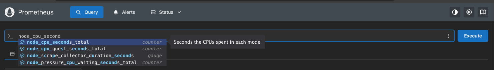

### view all

- show all metrics for node_cpu_seconds_total

Query: node_cpu_seconds_total

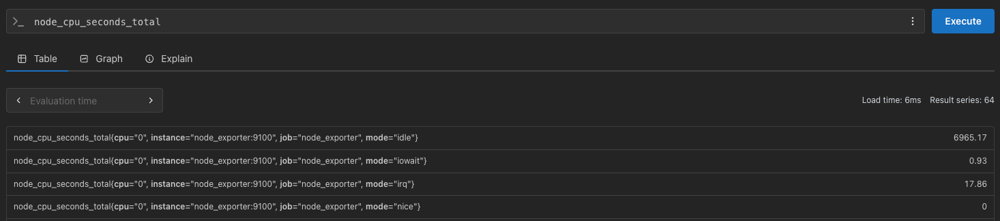

### view last x mins

- show all metrics for last 1m, result set is based one query duration and scrape interval in prometheus.  Usually (15 sec ones, 4 times in a minute)

Query: node_cpu_seconds_total[1m]

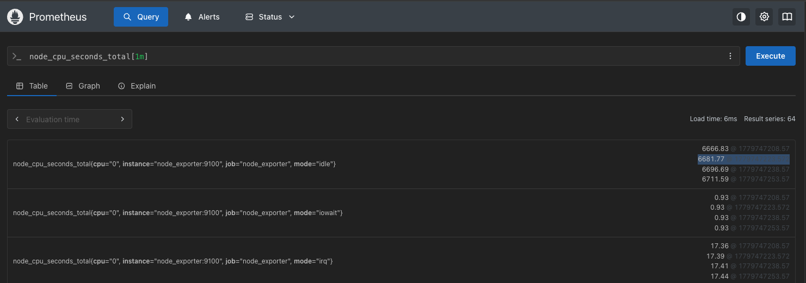

### arithmatic 

+, - , *, / , %, ^

the result of add is always a new vector

#### add

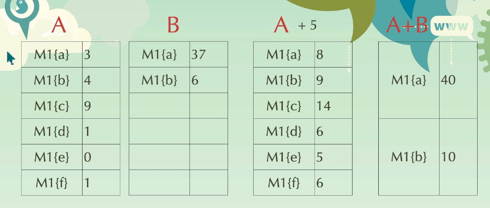

Query: node_cpu_seconds_total{cpu="1"}

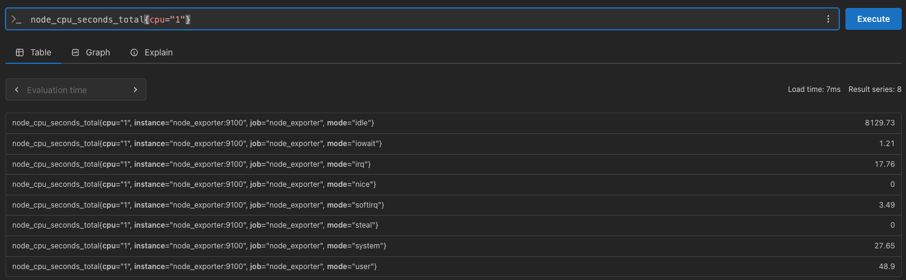

Query: node_cpu_seconds_total{cpu="1",mode=~"s.*"}

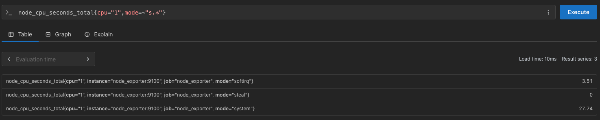

### comparison 

==, !=, >, <, >=, <=, =~, !~

#### compare

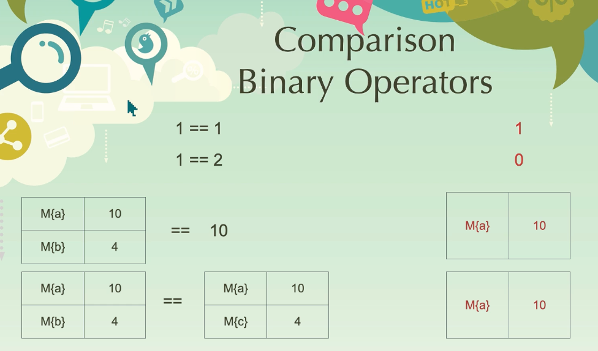

### binary 

and, or, unless

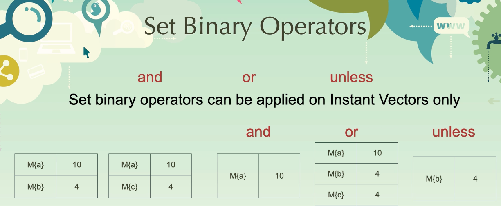

### aggregation 

sum, min, max, avg, count, group, count_value, topk, bottomk, stdvar, stdvar

Query: node_cpu_seconds_total{cpu="1"}

#### sum

sum of all values matching the query.

Query: sum(node_cpu_seconds_total{cpu="1"})

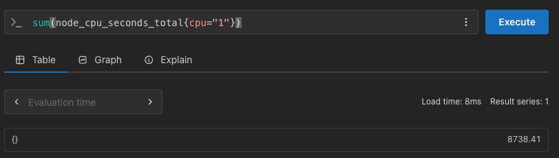

#### sum by filter

Query: sum(node_cpu_seconds_total{cpu="1"}) by (mode)

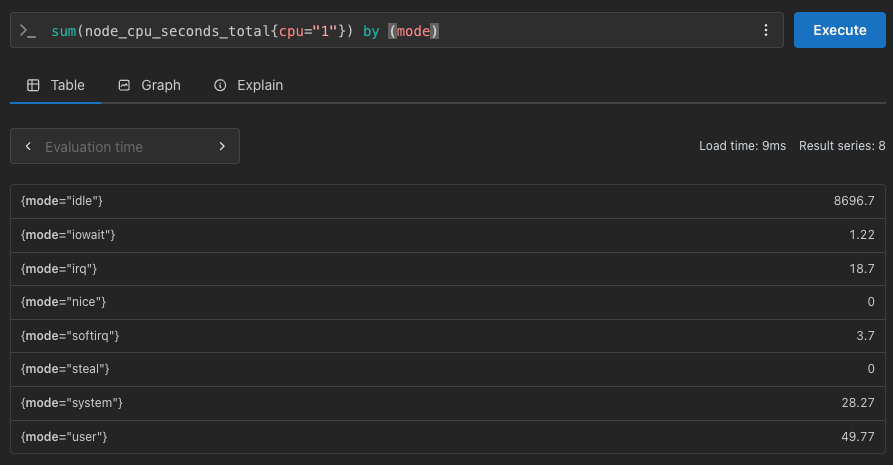

Query: sum(node_cpu_seconds_total) without (mode)

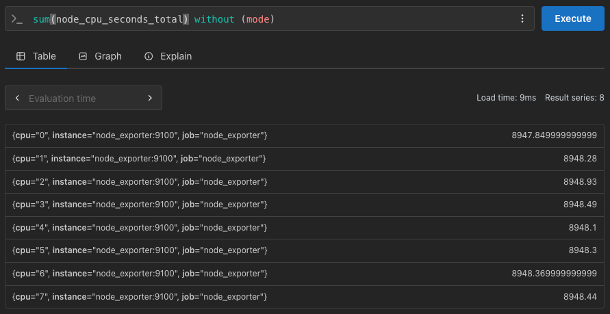

#### topk

Query: topk(3, sum(node_cpu_seconds_total) without (mode))

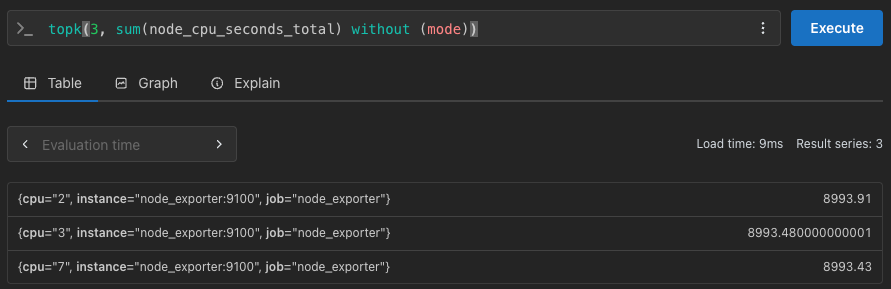

#### group by

group by always returns value as 1.

Query: prometheus_http_requests_total

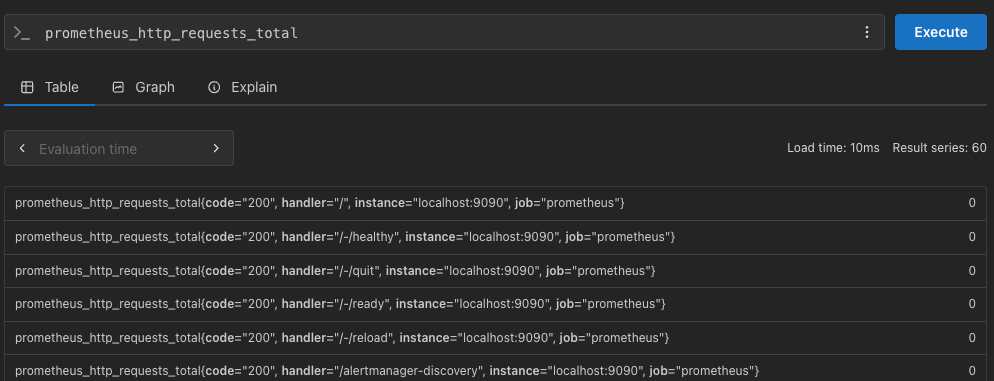

Query: group(prometheus_http_requests_total) by (code)

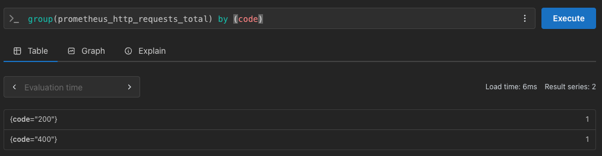

#### offset 

not latest, X time ago

prometheus_http_requests_total{handler="/api/v1/query"}

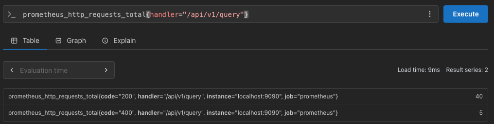

prometheus_http_requests_total{handler="/api/v1/query"}  offset 30s

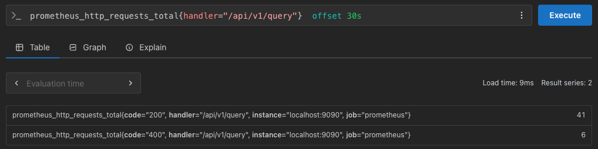

