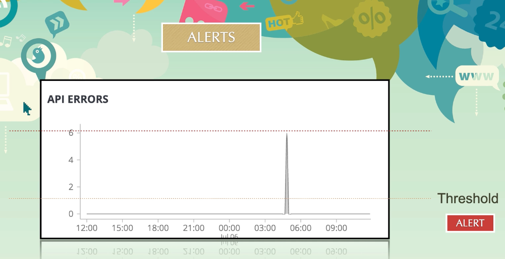
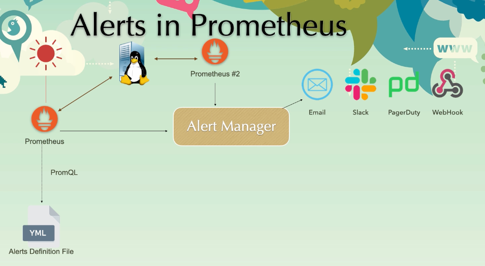
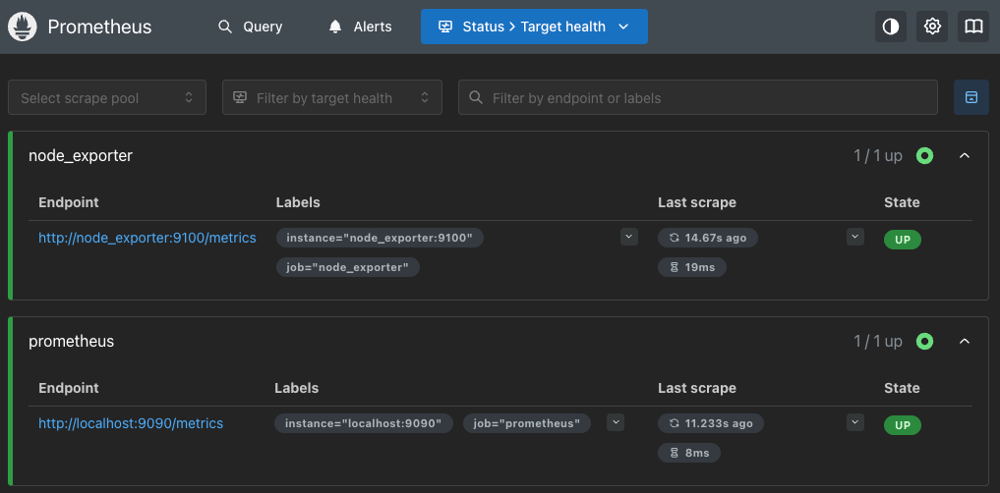
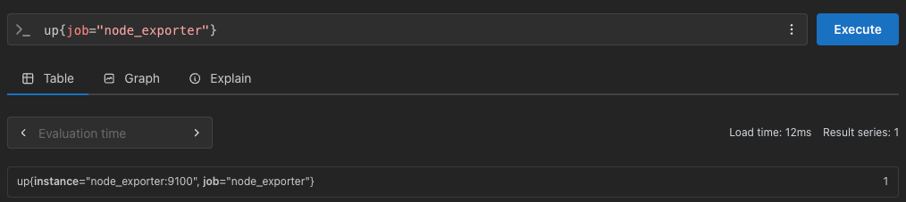
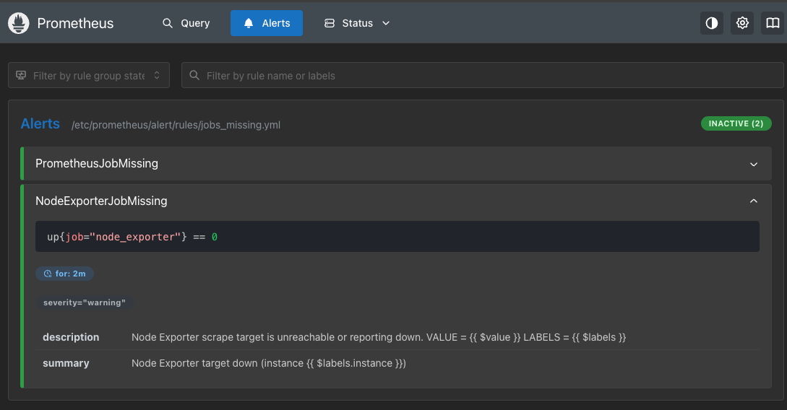

# Alerts

Alerts are define
d with a range of threshold.

## Alert Manager

- alerts are configured in prometheus server
- in central system multiple prometheus server may be monitoring the app server
- during issue both prometheus raise alerts
- alert manager handler this multiple alerts and sends one notification
- alert manager handler how frequent to notify
- provides various integration tools

## Setup

Scope setup alert for prometheus target (self).

1. Get target name

    

2. Verify the query

    

3. Add alert rules

   - alert: NodeExporterJobMissing
     expr: up{job="node_exporter"} == 0
     for: 2m
     labels:
       severity: warning
     annotations:
       summary: Node Exporter target down (instance {{ $labels.instance }})
       description: "Node Exporter scrape target is unreachable or reporting down.\n  VALUE = {{ $value }}\n  LABELS = {{ $labels }}"

   [jobs_missing.yml](rules/jobs_missing.yml)

4. Add alerts in prometheus

   scrape_configs:
   rule_files:
     - "alert/rules/jobs_missing.yml"

   [prometheus.yml](../prometheus.yml)

5. Restart compose

6. Validate in UI

   

## Examples in internet

https://samber.github.io/awesome-prometheus-alerts/rules/basic-resource-monitoring/prometheus-self-monitoring/
