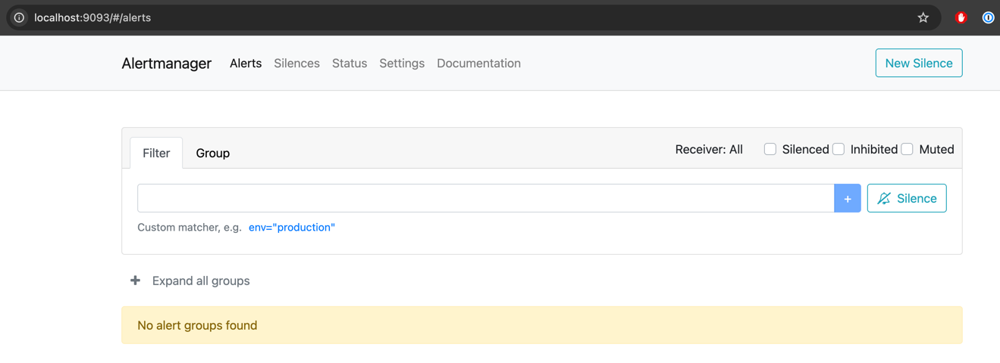
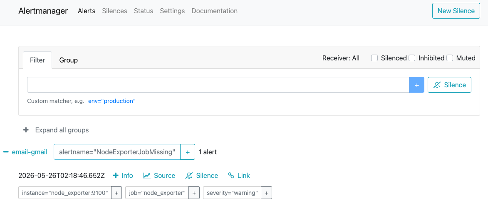
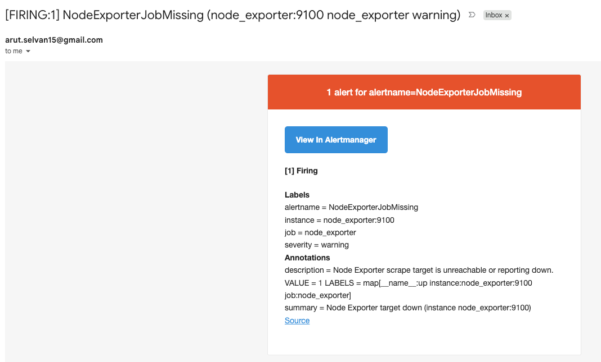
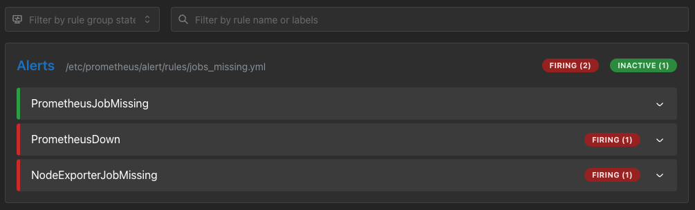
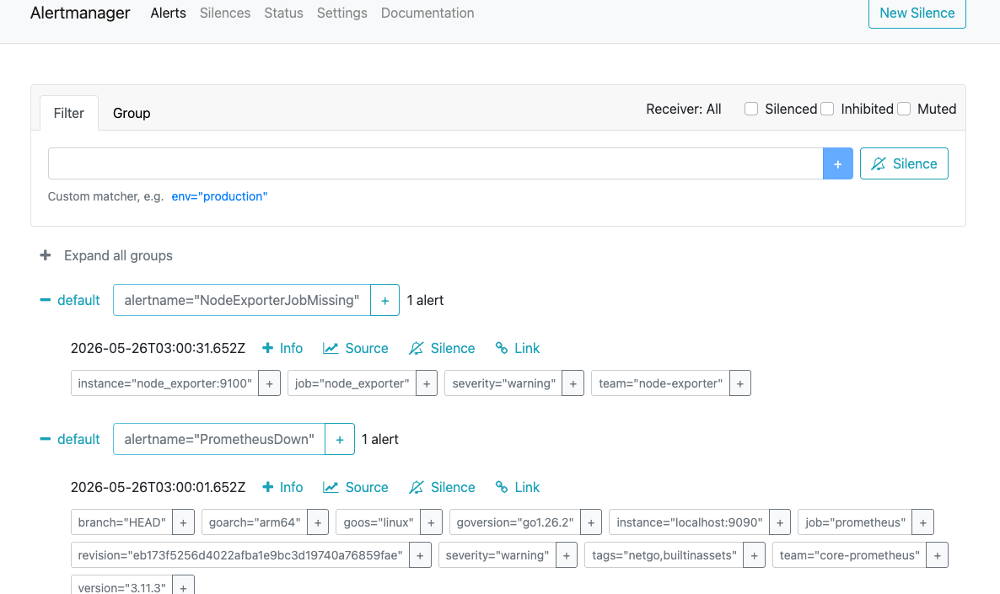
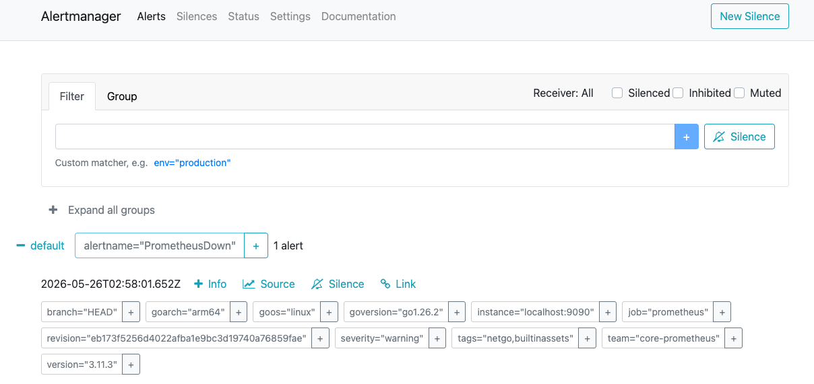

# Alert Manager

## Setup

- Add alert manager config

    ```
    global:
      resolve_timeout: 5m
    
    route:
      group_by: ['alertname']
      group_wait: 10s
      group_interval: 10s
      repeat_interval: 1h
      receiver: default
    
    receivers:
      - name: default
    ```
    
    [alertmanager.yml](alertmanager.yml)

    refer this link for complete config https://prometheus.io/docs/alerting/latest/configuration/

- Add alert manager in compose

  ```
  alertmanager:
      image: prom/alertmanager
      container_name: alertmanager
      command:
        - '--config.file=/etc/alertmanager/alertmanager.yml'
        - '--storage.path=/alertmanager'
      ports:
        - 9093:9093
      restart: unless-stopped
      volumes:
        - ./prometheus/alertmanager:/etc/alertmanager
  ```

    [compose.yaml](../../compose.yaml)

- Run compose up
  
- Validate the UI
        
  http://localhost:9093/#/alerts
  
  

## Email Receiver

- Add new receiver for gmail

```
# A list of notification receivers.
receivers:
  - name: default
  - name: email-gmail
    email_configs:
      - smarthost: 'smtp.gmail.com:587'
        to: "arut.selvan15@gmail.com"
        from: "arut.selvan15@gmail.com"
        auth_username: "arut.selvan15@gmail.com"
        auth_password: ""  # create gmail app password and use here
```

[alertmanager.yml](alertmanager.yml)

- Add route matcher

Any alert match the label "severity=warning" will be notified.  You can have multiple receivers with different conditions.

```
  # custom receivers
  routes:
    - receiver: email-gmail
      matchers:
        - severity="warning"
    - receiver: email-gmail
      matchers:
        - severity="high"
```

[alertmanager.yml](alertmanager.yml)

- Restart compose
- Validate alert in alert manager
    
- Validate email
    

## Inhibiting Alerts

- silencing is temporary
- inhibiting is permanent

When to use inhibit rule?

You have a server and a website hosted in it.  Prometheus alerts are configured to monitor the server and the website.  
When the server does down the app will also go down, this will result in triggering both the alerts.

When your server comes up the app will come up automatically, in this case we can enable inhibiting rule not to notify app down during server down.

Use case:  
- Alert for prometheus job (refer PrometheusJobMissing)
- Alert for node exporter job (refer NodeExporterJobMissing)
- node exporter will not be available when prometheus itself not up
- Add inhibiting alert not to notify node exporter when prometheus is down.

1. Enable alerts for prometheus down and node exporter missing. (PrometheusDown, NodeExporterJobMissing)

    For simulation set force fail condition (prometheus_build_info == 1, up{job="node_exporter"} == 1)

2. Run compose up
3. Observe the alert state and status in alert manager.

    

    both failures appeared in alerts.

    

    alert manager triggered not both rules.

4. Add inhibiting rule

    ```
    inhibit_rules:
      - source_match:
          team: "core-prometheus"
        target_match:
          team: "node-exporter"
        equal: ["severity"]       # when severity is same in both teams
    ```

    [alertmanager.yml](alertmanager.yml)

5. Restart compose
6. Observe the alert state and status in alert manager.

    

    both failures appeared in alerts.

    

    alert manager triggered for prometheus failure only.

